# Learning Mermaid

- [Learning Mermaid](#learning-mermaid)
  - [What is mermaid diagram](#what-is-mermaid-diagram)
  - [Flowchart](#flowchart)
    - [Orientation](#orientation)
      - [Default (Top Bottom / Top Down)](#default-top-bottom--top-down)
      - [Left Right](#left-right)
      - [Right Left](#right-left)
    - [Shapes](#shapes)
    - [Arrows and Links](#arrows-and-links)
      - [Arrow](#arrow)
      - [Thicker Arrow](#thicker-arrow)
      - [Open link](#open-link)
      - [Dotted arrow](#dotted-arrow)
    - [Adding labels](#adding-labels)
    - [Adding conditions](#adding-conditions)
  - [Sequence diagram](#sequence-diagram)
  - [Gantt diagram](#gantt-diagram)
  - [Class diagram](#class-diagram)
  - [Git graph](#git-graph)
  - [Entity Relationship Diagram](#entity-relationship-diagram)
  - [User Journey Diagram](#user-journey-diagram)
  - [References](#references)

## What is mermaid diagram

It is a JavaScript based diagramming and charting tool that renders Markdown-inspired text definitions to create and modify diagrams dynamically.

- Flowchart
- Sequence diagram
- Gantt diagram
- Class diagram
- Git graph
- Entity Relationship Diagram
- User Journey Diagram

## Flowchart

### Orientation

- TB - top to bottom
- TD - top-down/ same as top to bottom
- BT - bottom to top
- RL - right to left
- LR - left to right

#### Default (Top Bottom / Top Down)

~~~txt
  ```mermaid
  graph TD
    A --> B
    A --> C
    C --> D
    B --> E
    D --> F
    E --> F
  ```
~~~

__Output:__

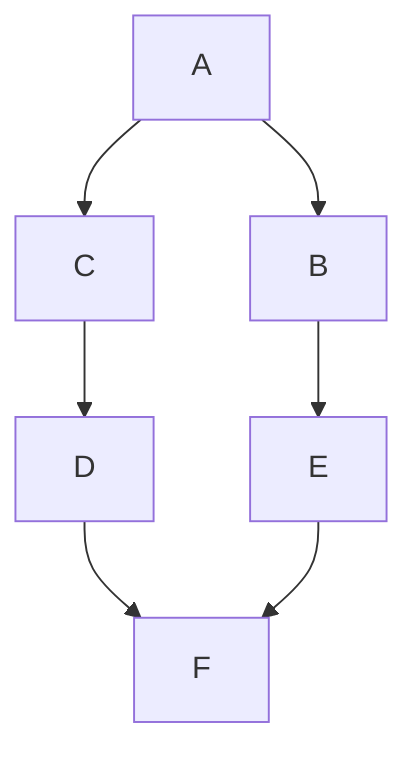

#### Left Right

~~~txt
  ```mermaid
  graph LR
    A --> B
    A --> C
    C --> D
    B --> E
    D --> F
    E --> F
  ```
~~~

__Output:__

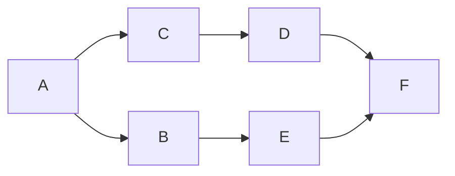

#### Right Left

~~~txt
  ```mermaid
  graph RL
    A --> B
    A --> C
    C --> D
    B --> E
    D --> F
    E --> F
  ```
~~~

__Output:__

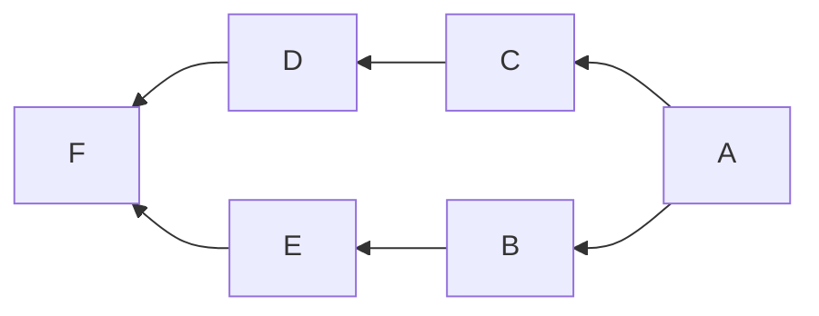

### Shapes

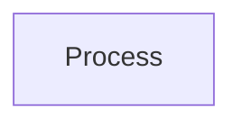

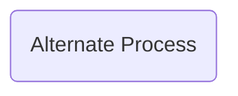

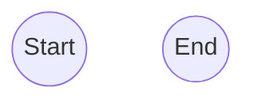

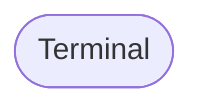

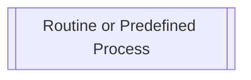

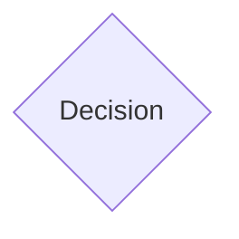

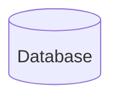

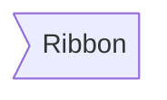

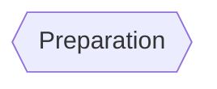

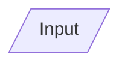

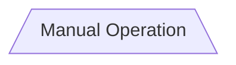

### Arrows and Links

#### Arrow

~~~txt
  ```mermaid
  graph LR
    A-->B
  ```
~~~

__Output:__


#### Thicker Arrow

~~~txt
  ```mermaid
  graph LR
    A==>B
  ```
~~~

__Output:__

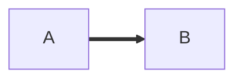

#### Open link

~~~txt
  ```mermaid
  graph LR
    A --- B
  ```
~~~

__Output:__

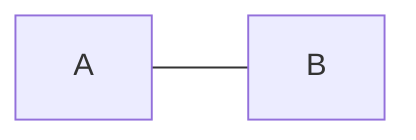

#### Dotted arrow

~~~txt
  ```mermaid
  graph LR
    A -.-> B
  ```
~~~

__Output:__

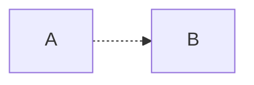

### Adding labels

To add Labels on a flowchart we simply use brackets `[]`

~~~txt
  ```mermaid
  graph LR
    A[Start] --> B[Input value]
    B --> C[Process values]
    C --> D[Finish]
  ```
~~~

__Output:__

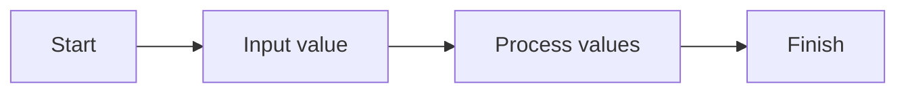

### Adding conditions  

To add conditions to the flowchart we use curly braces `{}` and to add response we use pipes `||`

~~~txt
  ```mermaid
  graph TD
    A[Start] --> B[Input value]
    B --> C{Value is over 18?}
    C --> |Yes| D[Retrieve data]
    C --> |No| E[Decline access]
    D --> F[Finish]
    E --> F[Finish]
  ```
~~~

__Output:__

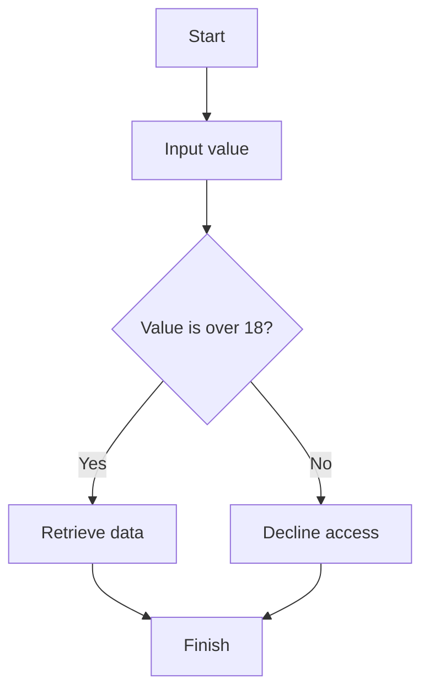

## Sequence diagram

## Gantt diagram

## Class diagram

## Git graph

## Entity Relationship Diagram

## User Journey Diagram

## References

- [Mermaid Documentation](https://mermaid-js.github.io/mermaid/#/)
