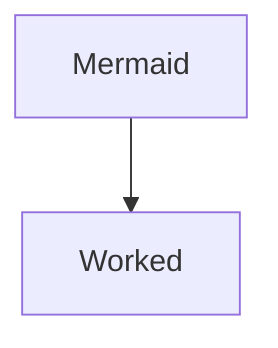

# Learning Mermaid

- [Learning Mermaid](#learning-mermaid)
  - [What is mermaid diagram](#what-is-mermaid-diagram)
    - [Fluxogram](#fluxogram)
      - [Left to Right](#left-to-right)
      - [Right to Left](#right-to-left)
      - [Top Down](#top-down)

## What is mermaid diagram

### Fluxogram

#### Left to Right

~~~txt
  ```mermaid
  graph LR
  Mermaid --> Worked
  ```
~~~

Output:


#### Right to Left

~~~txt
  ```mermaid
  graph RL
  Mermaid --> Worked
  ```
~~~

Output:


#### Top Down

~~~txt
  ```mermaid
  graph
  Mermaid --> Worked
  ```
~~~

Output:


