# Learning Mermaid

- [Learning Mermaid](#learning-mermaid)
  - [What is mermaid diagram](#what-is-mermaid-diagram)
  - [Basic syntax](#basic-syntax)
    - [Comments](#comments)
    - [Basic diagram](#basic-diagram)
    - [Basic orientation](#basic-orientation)
      - [Default (Top Bottom / Top Down)](#default-top-bottom--top-down)
      - [Bottom Top](#bottom-top)
      - [Left Right](#left-right)
      - [Right Left](#right-left)
    - [Arrows and Links](#arrows-and-links)
      - [Arrow](#arrow)
      - [Thicker Arrow](#thicker-arrow)
      - [Open link](#open-link)
      - [Dotted arrow](#dotted-arrow)
    - [Adding Label](#adding-label)
    - [Subgraph](#subgraph)
      - [Implicit subgraph / Labeled subgraph](#implicit-subgraph--labeled-subgraph)
      - [Directions](#directions)
    - [Adding conditions](#adding-conditions)
    - [Interactions](#interactions)
    - [Nested nodes](#nested-nodes)
    - [Styling curves](#styling-curves)
      - [Natural](#natural)
      - [Basis](#basis)
      - [Bump](#bump)
      - [Linear](#linear)
      - [MonotoneX](#monotonex)
      - [MonotoneY](#monotoney)
      - [Step](#step)
      - [StepAfter](#stepafter)
      - [StepBefore](#stepbefore)
    - [Mermaid available symbols](#mermaid-available-symbols)
  - [Flowchart](#flowchart)
    - [Types](#types)
    - [Flowchart with Mermaid](#flowchart-with-mermaid)
  - [Sequence diagram](#sequence-diagram)
  - [State diagram](#state-diagram)
  - [Gantt diagram](#gantt-diagram)
  - [Class diagram](#class-diagram)
  - [Git graph](#git-graph)
  - [Entity relationship diagram](#entity-relationship-diagram)
  - [User journey diagram](#user-journey-diagram)
  - [References](#references)

## What is mermaid diagram

It is a JavaScript based diagramming and charting tool that renders Markdown-inspired text definitions to create and modify diagrams dynamically.

- Flowchart
- Sequence diagram
- State diagram
- Gantt diagram
- Class diagram
- Git graph
- Entity relationship diagram
- User journey diagram

## Basic syntax

### Comments

To write comments use the prefix `%%`

~~~txt
  ```mermaid
  graph LR
    %% this is a comment that won't be renderer
    A --> B
    B --> C
  ```
~~~

**Output:**

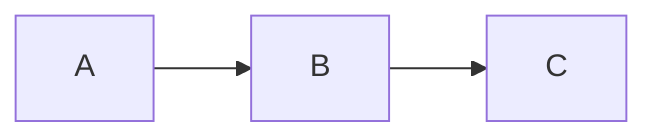

### Basic diagram

~~~txt
  ```mermaid
  graph LR
    A([Start]) --> B[/Input value/]
    B --> C[[Process values]]
    C --> D[/Output/]
    D --> E([Finish])
  ```
~~~

**Output:**

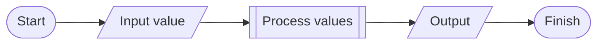

### Basic orientation

- TB - top to bottom
- TD - top-down/ same as top to bottom
- BT - bottom to top
- RL - right to left
- LR - left to right

#### Default (Top Bottom / Top Down)

~~~txt
  ```mermaid
  graph
    A --> B
  ```
~~~

**Output:**

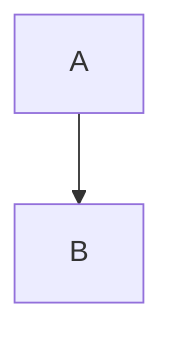

#### Bottom Top

~~~txt
  ```mermaid
  graph BT
    A --> B
  ```
~~~

**Output:**

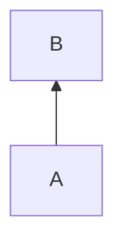

#### Left Right

~~~txt
  ```mermaid
  graph LR
    A --> B
  ```
~~~

**Output:**


#### Right Left

~~~txt
  ```mermaid
  graph RL
    A --> B
  ```
~~~

**Output:**

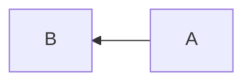

### Arrows and Links

#### Arrow

~~~txt
  ```mermaid
  graph LR
    A-->B
  ```
~~~

**Output:**


#### Thicker Arrow

~~~txt
  ```mermaid
  graph LR
    A==>B
  ```
~~~

**Output:**

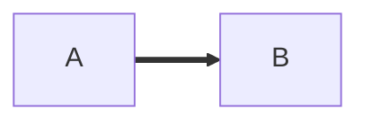

#### Open link

~~~txt
  ```mermaid
  graph LR
    A --- B
  ```
~~~

**Output:**

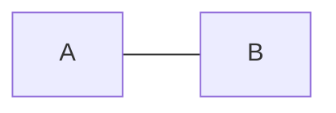

#### Dotted arrow

~~~txt
  ```mermaid
  graph LR
    A -.-> B
  ```
~~~

**Output:**

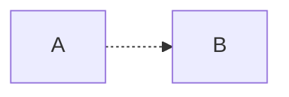


### Adding Label

To add labels to a link we use `|` before a node

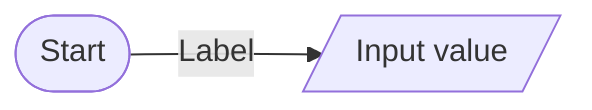

### Subgraph

Subgraphs can be use to breakdown a flow into blocks

~~~txt
  ```mermaid
  graph LR
    subgraph One
      A --> B
      B --> C
    end
    subgraph Two 
      D --> E
      E --> F
    end
    subgraph Three
      C --> G
      F --> G
      G --> H
      H --> I
    end    
  ```
~~~

**Output:**

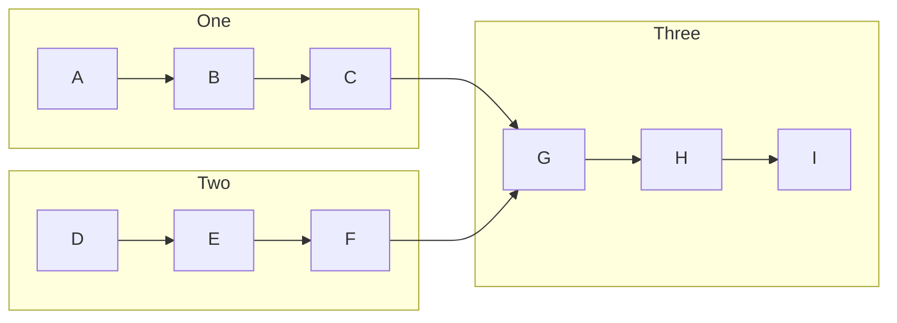

#### Implicit subgraph / Labeled subgraph

Subgraphs can have implicit names, for that we use a label with brackets `[label]`

~~~txt
  ```mermaid
  graph LR
    subgraph one
      A --> B
      B --> C
    end
    subgraph two
      D --> E
      E --> F
    end
    subgraph three [Final]
      G --> H
      H --> I
    end
    C --> G
    F --> G
  ```
~~~

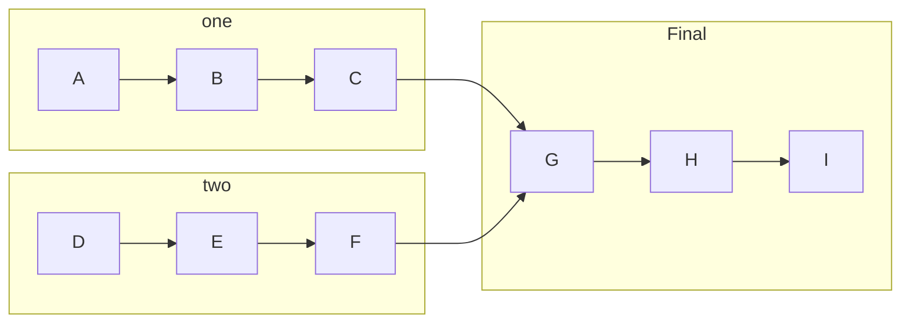

#### Directions

To adjust has to use subgraphs, but I don't get exactly how it works, doesn't seems to be consistent

~~~txt
  ```mermaid
  graph LR
    subgraph Main
    direction TB
      A1 --> A2
      A2 --> A3
      subgraph Two
        B1 --> B2
        B2 --> B3
      end
      subgraph One
        C1 --> C2
        C2 --> C3
      end
    end
  ```
~~~

**Output:**

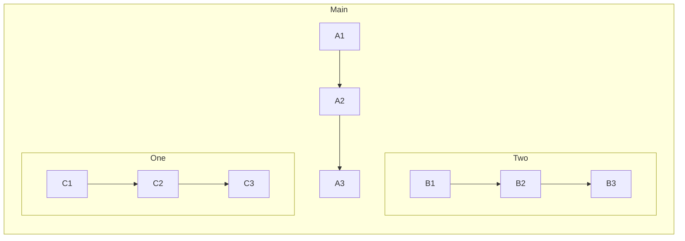

### Adding conditions  

To add conditions to the flowchart we use curly braces `{}` and to add response we use labels

~~~txt
  ```mermaid
  graph TD
    A([Start]) --> B[Input value]
    B --> C{Value is over 18?}
    C --> |Yes| D[Retrieve data]
    C --> |No| E[Decline access]
    D --> F([Finish])
    E --> B
  ```
~~~

**Output:**

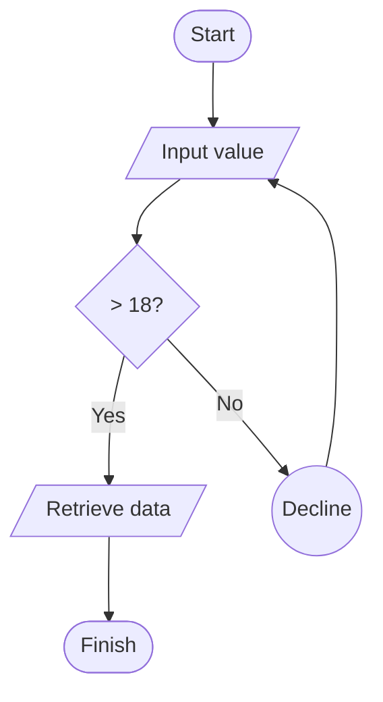

### Interactions

Interactions allow us to trigger clicks, but seems it doesn't work on github

~~~txt
```mermaid
flowchart LR
  A-->B
  B-->C
  C-->D
  D-->E
  click A "https://www.github.com" _blank
  click B "https://www.github.com" "Open this in a new tab" _blank
  click C href "https://www.github.com" _blank
  click D href "https://www.github.com" "Open this in a new tab" _blank
  ```
~~~

**Output:**

```mermaid
flowchart LR
  A-->B
  B-->C
  C-->D
  D-->E
  click A "https://www.github.com" _blank
  click B "https://www.github.com" "Open this in a new tab" _blank
  click C href "https://www.github.com" _blank
  click D href "https://www.github.com" "Open this in a new tab" _blank
```

### Nested nodes

~~~txt
  ```mermaid
  graph LR
    A 
    --> B
    --> C
    --> D 
  ```
~~~

**Output:**

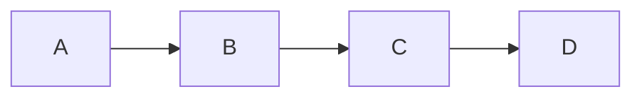

### Styling curves

It is possible to style the type of curve used for lines between items, if the default method does not meet your needs.
Available styles

- [`natural`](#natural)
- [`basis`](#basis)
- [`bump`](#bump)
- [`linear`](#linear)
- [`monotoneX`](#monotonex)
- [`monotoneY`](#monotoney)
- [`step`](#step)
- [`stepAfter`](#stepafter)
- [`stepBefore`](#stepbefore)

In this example, a left-to-right graph uses the stepBefore curve style:

```txt
  %%{ init: { 'flowchart': { 'curve': 'stepBefore' } } }%%
  graph LR
```

#### Natural

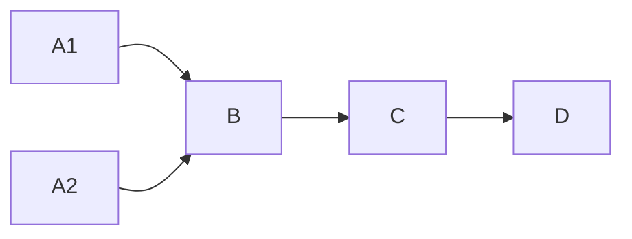

#### Basis


#### Bump

```mermaid
  %%{ init: { 'flowchart': { 'curve': 'bump' } } }%%
    graph LR
    A1 --> B
    A2 --> B
    B
    --> C
    --> D
```

#### Linear

```mermaid
  %%{ init: { 'flowchart': { 'curve': 'linear' } } }%%
    graph LR
    A1 --> B
    A2 --> B
    B
    --> C
    --> D
```

#### MonotoneX

```mermaid
  %%{ init: { 'flowchart': { 'curve': 'monotoneX' } } }%%
    graph LR
    A1 --> B
    A2 --> B
    B
    --> C
    --> D
```

#### MonotoneY

```mermaid
  %%{ init: { 'flowchart': { 'curve': 'monotoneY' } } }%%
    graph LR
    A1 --> B
    A2 --> B
    B
    --> C
    --> D
```

#### Step

```mermaid
  %%{ init: { 'flowchart': { 'curve': 'step' } } }%%
    graph LR
    A1 --> B
    A2 --> B
    B
    --> C
    --> D
```

#### StepAfter

```mermaid
  %%{ init: { 'flowchart': { 'curve': 'stepAfter' } } }%%
    graph LR
    A1 --> B
    A2 --> B
    B
    --> C
    --> D
```

#### StepBefore

```mermaid
  %%{ init: { 'flowchart': { 'curve': 'stepBefore' } } }%%
    graph LR
    A1 --> B
    A2 --> B
    B
    --> C
    --> D
```

### Mermaid available symbols

```mermaid
graph
  A[Process]
```

```mermaid
graph
  A(Alternate Process)
```

```mermaid
graph
  A((Interface))
```

```mermaid
graph
  A([Terminal])
```

```mermaid
graph
  A[[Routine or Predefined Process]]
```

```mermaid
graph
  A{Decision}
```

```mermaid
graph
  A[(Database)]
```

```mermaid
graph
  A>Ribbon]
```

```mermaid
graph
  A{{Preparation}}
```

```mermaid
graph
  A[/Input or Output/]
  B[\Input or Output\]
```

```mermaid
graph
  A[/Manual Operation\]
  A[\Manual Operation/]
```

## Flowchart

Flowcharts is a diagram used to represent various flows in many different areas, to use specific flowchart instead of the prefix `graph` we use `flowchart`, this allow us to use enhanced features to build more conceivable flowcharts

For instance normal graph have limited use of subgraphs, however flowcharts allows us to have block links and handle better direction within the chart

~~~txt
  ```mermaid
  flowchart LR
  A --> B
  B --> C
    subgraph Process
      D --> E
      E --> F
    end

  C -->   Process
  Process --> H
  ```
~~~

**Output:**

```mermaid
flowchart LR
A --> B
B --> C
  subgraph Process
    D --> E
    E --> F
  end

C -->   Process
Process --> H
```

### Types

- **Basic** - To represent the flow from a process
- **Fishbone** - Convenient to represent steps to take or paths to follow to reach a goal etc..
- **SDL Diagram** - To represent in high-level language procedural diagrams.
- **Data Flow Diagram** - To represent the data flow
- **Highlight** - Basically to highlight group of flows, algorithms, processes and data flows  
- **Audit Diagram** - Mostly in Finance area
- **Business Process** Model -  To modeling business and it's processes
- **System** - To represent whole system flow
- **Cross-functional** - To represent correlation of flow between different areas or services
- **Workflow Diagram** - To represent various flows used to work

### Flowchart with Mermaid

Sad mermaid only covers most basic flowcharts, to create

## Sequence diagram

## State diagram

## Gantt diagram

## Class diagram

## Git graph

## Entity relationship diagram

## User journey diagram

## References

- [Mermaid Documentation](https://mermaid-js.github.io/mermaid/#/)
- [Mermaid JS - Github](https://github.com/mermaid-js/mermaid)
- [Flowcharts Concept](https://www.edrawmax.com/flowchart/)
