# Learning Mermaid

- [Learning Mermaid](#learning-mermaid)
  - [What is mermaid diagram](#what-is-mermaid-diagram)
  - [Flowchart](#flowchart)
    - [Types of Flowcharts](#types-of-flowcharts)
    - [Create a Flowchart with Mermaid](#create-a-flowchart-with-mermaid)
    - [Flowchart orientation](#flowchart-orientation)
      - [Default (Top Bottom / Top Down)](#default-top-bottom--top-down)
      - [Bottom Top](#bottom-top)
      - [Left Right](#left-right)
      - [Right Left](#right-left)
    - [Mermaid available symbols](#mermaid-available-symbols)
    - [Arrows and Links](#arrows-and-links)
      - [Arrow](#arrow)
      - [Thicker Arrow](#thicker-arrow)
      - [Open link](#open-link)
      - [Dotted arrow](#dotted-arrow)
        - [Adding Label](#adding-label)
    - [Basic diagram](#basic-diagram)
    - [Subgraph](#subgraph)
    - [Adding conditions](#adding-conditions)
  - [Sequence diagram](#sequence-diagram)
  - [State diagram](#state-diagram)
  - [Gantt diagram](#gantt-diagram)
  - [Class diagram](#class-diagram)
  - [Git graph](#git-graph)
  - [Entity relationship diagram](#entity-relationship-diagram)
  - [User journey diagram](#user-journey-diagram)
  - [References](#references)

## What is mermaid diagram

It is a JavaScript based diagramming and charting tool that renders Markdown-inspired text definitions to create and modify diagrams dynamically.

- Flowchart
- Sequence diagram
- State diagram
- Gantt diagram
- Class diagram
- Git graph
- Entity relationship diagram
- User journey diagram

## Flowchart

Flowcharts is a diagram used to represent various flows in many different areas

### Types of Flowcharts

- Basic - To represent the flow from a process
- Fishbone - Convenient to represent steps to take or paths to follow to reach a goal etc..
- SDL Diagram - To represent in high-level language procedural diagrams.
- Data Flow Diagram - To represent the data flow
- Highlight Flowchart - Basically to highlight group of flows, algorithms, processes and data flows  
- Audit Diagram - Mostly in Finance area
- Business Process Model -  To modeling business and it's processes
- System Flowchart - To represent whole system flow
- Cross-functional Flowchart - To represent correlation of flow between different areas or services
- Workflow Diagram - To represent various flows used to work

### Create a Flowchart with Mermaid

Sad mermaid only covers most basic flowcharts, to create

### Flowchart orientation

- TB - top to bottom
- TD - top-down/ same as top to bottom
- BT - bottom to top
- RL - right to left
- LR - left to right

#### Default (Top Bottom / Top Down)

~~~txt
  ```mermaid
  graph
    A --> B
  ```
~~~

**Output:**

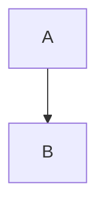

#### Bottom Top

~~~txt
  ```mermaid
  graph BT
    A --> B
  ```
~~~

**Output:**

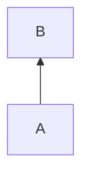

#### Left Right

~~~txt
  ```mermaid
  graph LR
    A --> B
  ```
~~~

**Output:**


#### Right Left

~~~txt
  ```mermaid
  graph RL
    A --> B
  ```
~~~

**Output:**

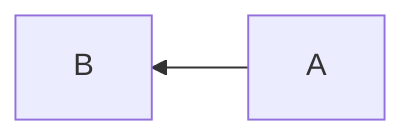

### Mermaid available symbols

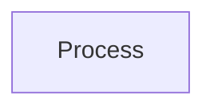

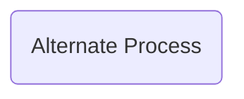

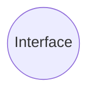

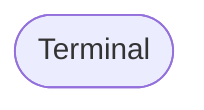

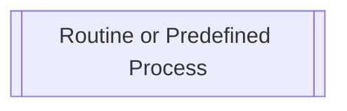

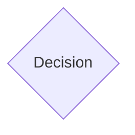

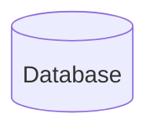


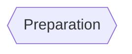

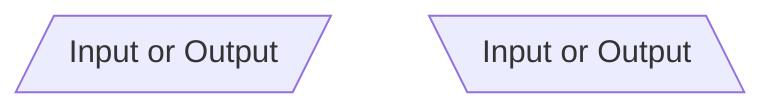

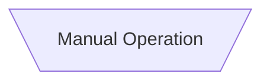

### Arrows and Links

#### Arrow

~~~txt
  ```mermaid
  graph LR
    A-->B
  ```
~~~

**Output:**


#### Thicker Arrow

~~~txt
  ```mermaid
  graph LR
    A==>B
  ```
~~~

**Output:**

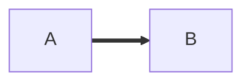

#### Open link

~~~txt
  ```mermaid
  graph LR
    A --- B
  ```
~~~

**Output:**

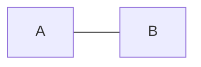

#### Dotted arrow

~~~txt
  ```mermaid
  graph LR
    A -.-> B
  ```
~~~

**Output:**

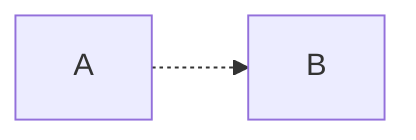


##### Adding Label

To add labels to a link we use `|` before a node

```mermaid
graph LR
A([Start]) -->|Label| B[/Input value/]
```

### Basic diagram

~~~txt
  ```mermaid
  graph LR
    A([Start]) --> B[/Input value/]
    B --> C[[Process values]]
    C --> D[/Output/]
    D --> E([Finish])
  ```
~~~

**Output:**

```mermaid
graph LR
  A([Start]) --> B[/Input value/]
  B --> C[[Process values]]
  C --> D[/Output/]
  D --> E([Finish])
```

### Subgraph

**Output:**

~~~txt
  ```mermaid
  graph LR
    subgraph One
      A --> B
      B --> C
    end
    subgraph Two 
      D --> E
      E --> F
    end
    subgraph Three
      C --> G
      F --> G
      G --> H
      H --> I
    end
  ```
~~~

```mermaid
graph LR
  subgraph One
    A --> B
    B --> C
  end
  subgraph Two 
    D --> E
    E --> F
  end
  subgraph Three
    C --> G
    F --> G
    G --> H
    H --> I
  end
```

### Adding conditions  

To add conditions to the flowchart we use curly braces `{}` and to add response we use labels

~~~txt
  ```mermaid
  graph TD
    A([Start]) --> B[Input value]
    B --> C{Value is over 18?}
    C --> |Yes| D[Retrieve data]
    C --> |No| E[Decline access]
    D --> F([Finish])
    E --> B
  ```
~~~

**Output:**

```mermaid
graph TD
  A([Start]) --> B[/Input value/]
  B --> C{Value is over 18?}
  C --> |Yes| D[/Retrieve data/]
  C ---> |No| E((Decline))
  D --> F([Finish])
  E --> B
```

## Sequence diagram

## State diagram

## Gantt diagram

## Class diagram

## Git graph

## Entity relationship diagram

## User journey diagram

## References

- [Mermaid Documentation](https://mermaid-js.github.io/mermaid/#/)
- [Mermaid JS - Github](https://github.com/mermaid-js/mermaid)
- [Flowcharts Concept](https://www.edrawmax.com/flowchart/)
