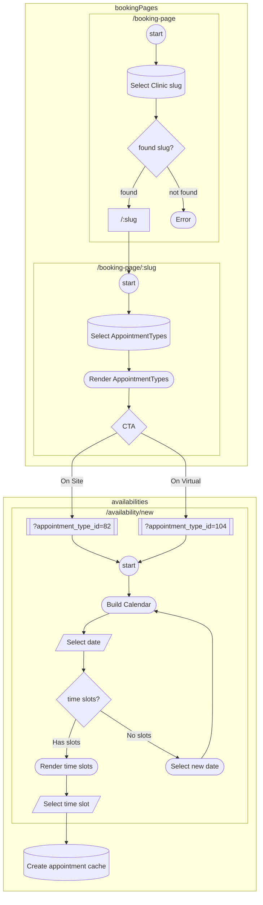

```mermaid
flowchart TD
  subgraph bookingPages
    subgraph bookingPagesIndex["/booking-page"]
      bookingPagesIndexView((start)) 
      --> check[(Select Clinic slug)] 
      --> has_slug{"found slug?"}
      has_slug --> |found| slug["/:slug"]
      has_slug --> |not found| error([Error])    
    end

    slug --> bookingPagesShowView

    subgraph bookingPagesShow["/booking-page/:slug"]
      bookingPagesShowView((start)) 
      --> types[(Select AppointmentTypes)]
      --> list([Render AppointmentTypes])
      --> cta{CTA}
    end
  end
  
  cta --> |On Site| onSite
  cta --> |On Virtual| virtual


  subgraph availabilities
    subgraph availabilitiesNew["/availability/new"]
      onSite[["?appointment_type_id=82"]] --> availabilitiesNewView 
      virtual[["?appointment_type_id=104"]] --> availabilitiesNewView 

      availabilitiesNewView((start)) 
        --> calendar(["Build Calendar"])
        --> selectDate[/"Select date"/]
        --> anySlot{"time slots?"}
        anySlot --> |Has slots| slots(["Render time slots"])
        anySlot --> |No slots| newDate(["Select new date"])
        
        slots --> selectSlot[/Select time slot/]
        newDate --> calendar
    end

    selectSlot --> build_cache[(Create appointment cache)]
  end


```
